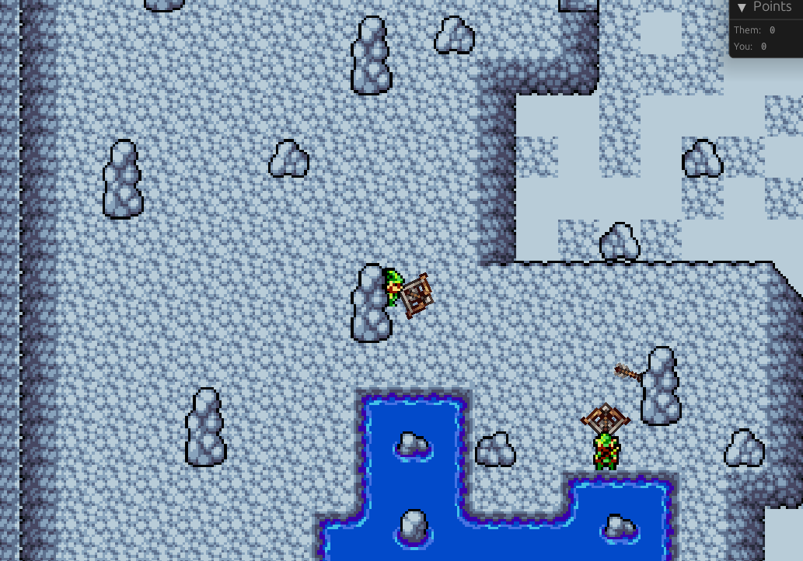

# p2pg

Unnamed 2d weaponry combat game. Uses p2p rollback netcode.

Playable in the browser on both mobile and pc.

Made in rust, with [bevy](bevyengine.org/), and [ggrs](https://github.com/gschup/ggrs/).

### Credits

- [Minifantasy SFX bundle](https://itch.io/s/79857/minifantasy-sfx-bundle)
- [Tiny Tales](https://megatiles.itch.io/tiny-tales-overworld-2d-tileset-asset-pack)
- [Weapon Assets](https://dantepixels.itch.io/weapons-asset-16x16)

